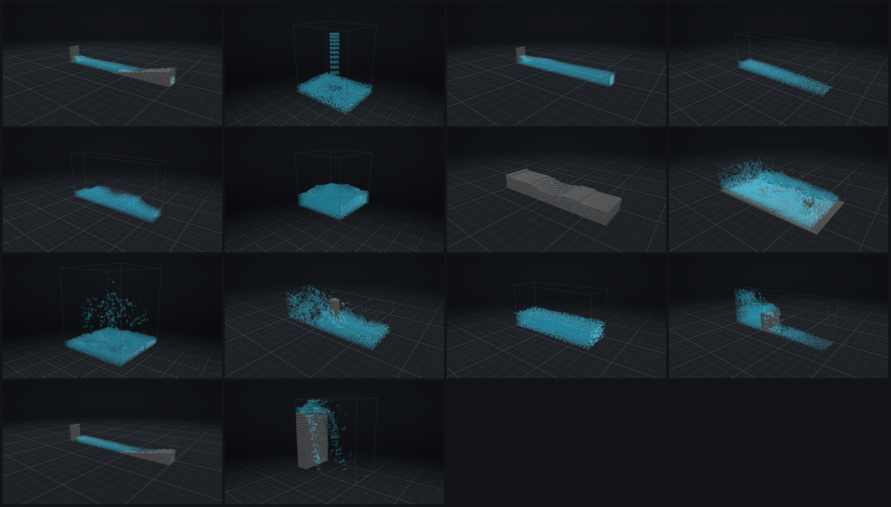

# Gallery

Fourteen scenarios, each composed from the same primitives in JSON. Every
entry states its **tier**, what physics it exercises, the parameters that
matter, and **one honest sentence on where the model is approximate**.

Clips and stills are produced by:

```bash
# needs a display (or Xvfb) and ffmpeg
xvfb-run -s "-screen 0 1600x900x24" scripts/make_gallery.sh medium
```

which writes `gallery/<quality>/<scenario>.mp4`, `.gif`, a still per
scenario, and `contact_sheet.png`. Media is **not committed** to this
repository — a few hundred megabytes of video does not belong in git, and
the point of a reproducible project is that you can regenerate it.

Every published frame states particle count, hardware, thread count,
render mode, resolution and whether it was offline or interactive; the
viewer prints all of that in its render summary for exactly this reason.
**No render in this project is real-time**, and none is described as such:
measured throughput is 5.5 steps/s at 218k particles on four cores.

---

## How to read the tiers

**Tier 1 — physically demonstrable.** The named phenomenon is resolved at
this particle count and can be checked against experiment or an analytical
result. Quantitative comparisons are in [`validation.md`](validation.md).

**Tier 2 — large-scale visual experiment.** Qualitatively informative and
visually compelling; **not quantitatively predictive at these
resolutions.** Every number a Tier 2 scenario reports is an internally
consistent measurement *of that simulation*. None of them is a forecast.

---

# Tier 1 — physically demonstrable

## `dam_break`

Collapse of a rectangular water column on a dry horizontal bed. The
canonical SPH validation case.

| | |
|---|---|
| **Exercises** | Free surface, surge front, impact, run-up on the far wall |
| **Domain** | 1.6 × 0.6 × 0.3 m, top open |
| **Column** | 0.25 m wide × 0.5 m tall (aspect ratio 2, matching Martin & Moyce's `n² = 2`) |
| **Resolution** | 21,525 fluid + 39,314 boundary particles at `medium` |
| **Expected** | Column collapses, surge crosses the floor, climbs the far wall, sloshes back and settles |
| **Measured** | Surge front position in Martin & Moyce scaling; two depth gauges. See [`validation.md`](validation.md) |

> **Approximation.** The retaining wall is removed instantaneously and
> completely, and the bed has no roughness beyond a single friction
> coefficient. Both are idealisations of the experiment.

## `double_dam_break`

Two opposing columns collapse, collide at the centre, and throw a vertical
jet.

| | |
|---|---|
| **Exercises** | Symmetric collision, jet formation, secondary collapse |
| **Domain** | 1.6 × 0.8 × 0.3 m |
| **Expected** | Fronts meet at the centre, a coherent vertical jet rises, falls back, and the tank sloshes |
| **Measured** | Centre-column elevation probe (the jet's height and period) |

> **Approximation.** The initial condition is perfectly left–right
> symmetric, so the simulated jet is more symmetric than any physical
> experiment could be — real collisions break symmetry almost immediately.

## `droplet_impact`

A droplet strikes a shallow pool; surface tension forms a crown and a
central Worthington jet.

| | |
|---|---|
| **Exercises** | Surface tension (cohesion + curvature), impact, crown formation |
| **Domain** | 90 × 90 mm, 20 mm pool |
| **Droplet** | 24 mm diameter at 2 m/s, σ = 0.38 N/m |
| **Resolution** | h = 3.8 mm — the finest scenario in the library |
| **Expected** | Crater forms, rim rises into a crown, central jet follows |

> **Approximation.** Run at a scaled-up droplet size with σ chosen to match
> the **Weber number** of a millimetric water droplet impact (We ≈ 250),
> because a real 2 mm droplet cannot be resolved at these particle counts.
> The dynamics are Weber-similar, but σ = 0.38 N/m is **not** water's
> 0.073 N/m and the absolute length and time scales are not those of a real
> raindrop.

## `sloshing_tank`

A partially filled tank is given a short horizontal impulse and then left
to oscillate freely.

| | |
|---|---|
| **Exercises** | Time-varying external force, standing waves, free-surface oscillation |
| **Domain** | 0.6 × 0.3 × 0.2 m, filled to 0.1 m |
| **Forcing** | `pulse` external force, 2 m/s² for 0.25 s |
| **Expected** | A coherent standing wave with a measurable, repeatable period |
| **Measured** | Period at both end walls, compared against shallow-water theory and the linear-dispersion first mode. See [`validation.md`](validation.md) |

> **Approximation.** Wall friction is one tunable coefficient rather than a
> resolved boundary layer, so the measured **decay rate** is not predictive
> even though the **period** is.

## `obstacle_flow`

Channel flow past a vertical cylinder: separation, wake, reconnection.

| | |
|---|---|
| **Exercises** | Boundary geometry, inflow emitter, open outflow |
| **Domain** | 1.2 × 0.35 × 0.4 m, outflow at `x_max` |
| **Obstacle** | 0.12 m diameter cylinder at x = 0.6 |
| **Inflow** | 1.4 m/s, ramped over 0.3 s |
| **Expected** | Flow accelerates around the cylinder, separates, forms a wake, reconnects downstream |
| **Measured** | Depth probes upstream, in the wake, and at reattachment |

> **Approximation.** The wake is laminar at this resolution. Real flow at
> this Reynolds number sheds a turbulent, three-dimensional wake that the
> artificial viscosity represents only as bulk dissipation.

## `controlled_wave_tank`

A piston wavemaker in a still-water flume; amplitude, period and celerity
are **measured**, not commanded.

| | |
|---|---|
| **Exercises** | Prescribed moving boundary, wave generation and propagation |
| **Domain** | 2.4 × 0.4 × 0.25 m flume, 0.2 m still depth |
| **Paddle** | 0.02 m amplitude, 0.9 s period, 0.9 s smoothstep ramp |
| **Expected** | A repeatable wave train at the commanded period, at an amplitude set by the wavemaker transfer function |
| **Measured** | Three wave gauges at 0.8 / 1.4 / 2.0 m; amplitude, period, wavelength and celerity fitted from zero up-crossings, against the linear (Biesel) prediction. See [`validation.md`](validation.md) |

> **Approximation.** The commanded wave height is about three particle
> spacings, so the **amplitude** measurement carries a quantisation floor
> of roughly one spacing; the **period** and **celerity**, which come from
> crossing times rather than surface height, are far better resolved. The
> flume holds only about two wavelengths, so results are read before
> reflections from the far wall return.

## `spillway`

A reservoir discharging over a broad-crested weir onto a downstream apron.

| | |
|---|---|
| **Exercises** | Constrained flow, gravity-driven acceleration, obstacle geometry, outflow |
| **Domain** | 1.4 × 0.5 × 0.25 m |
| **Weir** | 0.12 m thick, 0.25 m tall |
| **Expected** | Reservoir fills, flow crosses the crest, accelerates down the face, forms a supercritical sheet on the apron |
| **Measured** | Depth in the reservoir, at the crest, and on the apron |

> **Approximation.** The weir is a rectangular block, not a shaped ogee
> crest, so the discharge coefficient is that of a sharp-edged broad crest
> and should not be read as a design curve for any real spillway.

## `container_fill`

An inlet fills an empty vessel; the free surface rises and settles flat.

| | |
|---|---|
| **Exercises** | Emitters, growing particle count, free-surface settling |
| **Domain** | 0.4 × 0.45 × 0.3 m |
| **Inlet** | 70 mm nozzle at 1 m/s, stopping at t = 2.4 s |
| **Expected** | Vessel fills at a constant rate, the plunging jet's disturbance decays, the surface settles level |
| **Measured** | Depth at a corner and at the centre — the same once settled, which is the test |

> **Approximation.** The inlet is a prescribed-velocity source rather than
> a modelled pipe, so the entry jet's momentum is imposed rather than
> solved for.

---

# Tier 2 — large-scale visual experiments

**Every scenario below is a demonstration, not a prediction.** They are
metre-scale flume experiments rendered at metre scale — not scaled models
of large events. Froude similarity is not enforced.

## `flood`

Flow propagating over a sloping floodplain past obstacles, with downstream
outflow.

| | |
|---|---|
| **Exercises** | Inlet, terrain heightfield, obstacles, sinks, inundation metrics |
| **Domain** | 2.4 × 0.6 × 1.2 m |
| **Terrain** | Analytic slope plus two Gaussian rises |
| **Expected** | The inflow spreads across the plain, splits around the obstacles, drains downstream |
| **Measured** | Depth at three stations; inundated floor-area fraction and maximum depth |

> **A VISUALISATION, NOT A HYDROLOGICAL PREDICTION.** Terrain is an
> analytic slope with Gaussian bumps rather than survey data; there is no
> infiltration, no roughness model, no sediment, and no building failure.
> Depths and arrival times are internally consistent measurements of this
> simulation, not forecasts for any real site.

## `flash_flood`

A rapid-onset surge down a confined channel, driven by a sharply peaked
inflow hydrograph.

| | |
|---|---|
| **Exercises** | Keyframed emitter schedule, channel terrain, outflow |
| **Forcing** | A `keyframes` hydrograph peaking at t = 1.0 s |
| **Expected** | A steep-fronted surge propagates down the channel, peaks, recedes |
| **Measured** | Depth at three stations; arrival time is the difference between their rises |

> **QUALITATIVE ONLY.** The hydrograph is an invented keyframe curve, not
> a rainfall-runoff model, and the channel is a smooth analytic trough with
> no bed roughness or debris. This shows what a rapid-onset surge looks
> like; it does not predict one.

## `coastal_wave`

A wave train generated in deep water shoals up a plane beach and runs up
the slope.

| | |
|---|---|
| **Exercises** | Wave generator, bathymetry, shoaling, run-up |
| **Domain** | 3.0 × 0.45 × 0.3 m; 0.22 m depth, then a 1:4.5 beach |
| **Expected** | Waves shorten and steepen over the slope, then run up the beach |
| **Measured** | Gauges offshore, in the shoaling zone, and at run-up |

> **The surf zone is under-resolved.** Breaking, air entrainment and the
> resulting energy loss are not represented, so run-up is qualitative.
> Shoaling of the non-breaking wave in the deeper part of the flume is the
> part worth reading.

## `tsunami_pulse`

A single long-wave pulse launched by a sudden paddle displacement,
propagating over a shelf and running up a slope.

| | |
|---|---|
| **Exercises** | Pulse-mode wave generator, shelf and slope bathymetry, run-up, inundation |
| **Domain** | 3.0 × 0.45 × 0.3 m; 0.18 m depth |
| **Paddle** | Single 0.14 m displacement over 0.45 s |
| **Expected** | A solitary long wave propagates, shoals on the shelf, and runs up |

> **THIS IS A LONG-WAVE PROPAGATION EXPERIMENT, NOT A TSUNAMI MODEL.** A
> real tsunami is a hundreds-of-kilometre wave over ocean-depth bathymetry
> with Coriolis and dispersive effects over hours of propagation; this is a
> metre-scale flume pulse over a ramp lasting seconds. Nothing here
> transfers to any real coastline, and no inundation number from it should
> be quoted as a hazard estimate.

## `waterfall`

A continuous stream falls from a ledge into a plunge pool.

| | |
|---|---|
| **Exercises** | Emitter, free fall, plunge-pool impact, sink |
| **Domain** | 1.0 × 1.0 × 0.5 m; 0.8 m ledge |
| **Expected** | A continuous coherent stream, ballistic fall, sustained plunge pool with outward surface flow |
| **Measured** | Depth at the plunge point and at the far end of the pool |

> **The plunge is a two-phase problem.** A real waterfall entrains air and
> turns white. This solver is single-phase, so the plunge pool renders as
> clear water with no aeration, foam or spray. Those are Tier 3 extension
> points, not implemented — adding them as a pure render effect would be
> dishonest.

## `fountain`

A vertical nozzle jet rises, breaks up, and falls back into its basin.

| | |
|---|---|
| **Exercises** | Vertical emitter, ballistic trajectory, jet break-up, pool interaction |
| **Domain** | 0.8 × 0.9 × 0.8 m |
| **Nozzle** | 56 mm diameter at 3.2 m/s |
| **Expected** | The jet rises to roughly `v²/2g` ≈ 0.52 m, fragments, falls back and disturbs the basin |
| **Measured** | Elevation on the jet axis and in the basin |

> **Jet break-up is a surface-tension instability at scales far below the
> particle spacing here**, so the jet fragments at the resolution limit
> rather than at a physical Rayleigh–Plateau wavelength. The **trajectory**
> is ballistic and correct; the **break-up length** is not.

---

## The contact sheet



*All fourteen scenarios, `--quality low`, 960×540, four threads, offline
render on Mesa `llvmpipe` (software rasteriser, no GPU) under Xvfb. Each
still is taken 75% of the way through its run. **Not real-time** — see
the per-scenario cost table in `benchmarks/scaling_results.md`.*

`scripts/make_gallery.sh` produces this, plus an MP4 and a looping GIF per
scenario. Only the contact sheet is committed; the clips are about 39 MB
and the frame sequences about 900 MB, which do not belong in git.

It is meant to be read as a comparison, and that is only possible because
every scenario shares the same camera framing convention (38° yaw, ~20°
pitch, three-quarter view), the same palette, the same three-point
lighting and the same floor and grid. **What differs between tiles is the
physics.** If two tiles look alike, that is a finding about the
simulations, not about the art direction.

Reading across it, left to right and top to bottom: `coastal_wave`,
`container_fill`, `controlled_wave_tank`, `dam_break`;
`double_dam_break`, `droplet_impact`, `flash_flood`, `flood`; `fountain`,
`obstacle_flow`, `sloshing_tank`, `spillway`; `tsunami_pulse`,
`waterfall`.

### What this sheet shows honestly, including where it is unflattering

- **The obstacles read as solids.** The cylinder in `obstacle_flow`, the
  weir in `spillway`, the ledge in `waterfall` and the terrain in `flood`
  and `flash_flood` are all drawn from their own boundary particles, so
  what you see is exactly the geometry the solver has.
- **`low` does not resolve a surface, and that is the point of the
  preset.** At 2,000–12,000 fluid particles the screen-space
  reconstruction is visibly granular: individual impostors are
  distinguishable, and the `droplet_impact` crown does not form because
  the droplet is only a few hundred particles. This is a *resolution*
  limit, not a shader limit — raising the blur radius makes it worse, not
  better. `--quality high` is the showcase preset and is roughly 35× the
  cost.
- **Emitter layering is visible.** In `container_fill` the falling inlet
  stream reads as a stack of discrete discs rather than a continuous jet.
  That is real: the emitter releases one lattice layer per particle
  spacing of accumulated stream displacement, and at `low` the layers are
  wider apart than the impostors can bridge. It closes up at finer
  resolution; it is called out here rather than cropped out of frame.
- **`fountain` and `waterfall` fragment into visible particles.** Also
  real, and also resolution: jet break-up happens at scales far below the
  particle spacing, so the jet fragments at the resolution limit rather
  than at a physical Rayleigh–Plateau wavelength.
