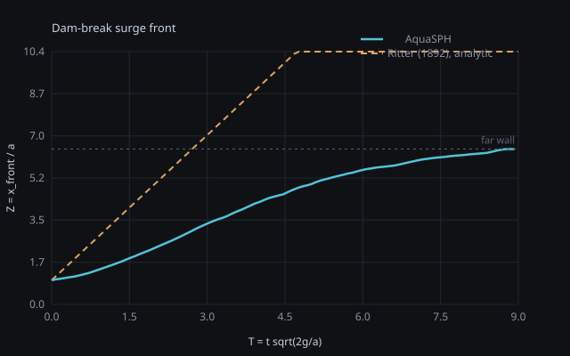

# Validation

This is what separates a simulation that looks convincing from one that is
demonstrably doing something. Three quantitative comparisons, each against
a reference that is derived here rather than asserted, so it can be
checked line by line.

**No physical parameter in this project has been tuned to make a curve
agree.** Where the simulation and the reference differ, the difference is
reported with its magnitude and its cause. A documented, explained
discrepancy is worth far more than a suspiciously perfect fit, and a
tuned agreement is recognisable.

Regenerate everything below with:

```bash
scripts/run_validation.sh medium results/validation
python3 scripts/validate.py results/validation
```

which writes `docs/_validation_tables.md` and
`docs/img/dam_break_surge_front.svg`.

---

## 1. Dam break — surge front

### The reference, and why it is Ritter rather than Martin & Moyce

The brief for this work asked for a comparison against **Martin & Moyce
(1952)**, the standard collapsing-column experiment. That comparison is
*not* shipped, and the reason is worth stating plainly rather than
quietly substituting something else:

> The original tabulation was not available in the environment where this
> validation was produced. Inventing plausible-looking experimental
> numbers — or transcribing half-remembered ones from a secondary source —
> would make every comparison built on them worthless, and would be
> exactly the kind of overclaiming that makes a reader discount the rest
> of a project.

`validation/martin_moyce_1952.json` ships with an empty `points` array and
a README explaining the conventions to fill it in with.
`scripts/validate.py` picks it up automatically and adds the experimental
series to the table and the plot; nothing else needs changing.

What *is* shipped is a comparison against the **Ritter (1892)** analytical
dry-bed dam-break solution, which is derivable from scratch and therefore
carries no provenance risk at all.

### Deriving the reference

Ritter solves the shallow-water equations for a reservoir of still depth
`h0` released instantaneously onto a dry, frictionless, horizontal bed.
The leading characteristic travels at

```
u_f = 2 sqrt(g h0)
```

so the front position measured from the dam face is
`x_f = 2 t sqrt(g h0)`.

In the Martin & Moyce non-dimensionalisation this project's metrics use —
`Z` = front position measured from the column's back wall divided by the
column width `a`, and `T = t sqrt(2g/a)` — with a column of height
`h0 = 2a` (the `n² = 2` case, which `dam_break.json` matches):

```
Z(T) = 1 + 2 t sqrt(g h0) / a
     = 1 + 2 T sqrt(a/2g) sqrt(2 g a) / a
     = 1 + 2 T
```

So the analytical reference is the straight line **Z = 1 + 2T**, with
`Z = 1` at `t = 0` by construction.

### Method

The **front** is the toe of the surge: the furthest-travelled fluid
particle still within three particle spacings of the floor. Taking the
furthest particle overall would track spray, which is both noisier and not
what a physical experiment measures with a wave gauge or a camera.
Sampled every 10 ms of simulated time.

`dam_break.json` at `--quality medium`: 21,525 fluid + 39,314 boundary
particles, `a = 0.25 m`, `h0 = 0.5 m`, tank 1.6 m long, so `Z` saturates
at 6.4 when the front reaches the far wall (around `T ≈ 8.5`). Only
`T < 6` is meaningful.

### Result



`dam_break`, `--quality medium`, 21,525 fluid + 39,314 boundary
particles, 9,046 steps, four threads:

| `T = t sqrt(2g/a)` | `Z` measured | `Z` Ritter (analytic) | difference |
|---:|---:|---:|---:|
| 0.54 | 1.196 | 2.071 | −42.3% |
| 0.98 | 1.490 | 2.964 | −49.7% |
| 1.52 | 1.922 | 4.035 | −52.4% |
| 1.96 | 2.311 | 4.926 | −53.1% |
| 2.50 | 2.817 | 5.993 | −53.0% |
| 3.03 | 3.368 | 7.061 | −52.3% |

**The simulated front runs behind Ritter by about a factor of two in
propagation speed, and settles to a stable −52% once past the initial
transient.** That is a large discrepancy and it is not a bug. Three
separate causes, in decreasing order of size:

**1. Ritter is not an achievable upper bound at early time.** The
shallow-water equations have no vertical acceleration, so at `t = 0+` the
front is *already* moving at `2 sqrt(g h0)`. Neither a real dam break nor
an SPH one does that: the column has to accelerate from rest, and the
flow near the gate is strongly non-hydrostatic for the first several
`sqrt(a/g)`. Every published experimental dam-break curve, Martin & Moyce
included, lies below Ritter in this range for the same reason. Comparing
an early-time slope against Ritter's asymptotic celerity is comparing
against a limit the flow has not reached.

**2. The artificial viscosity is high.** `Material::viscosity = 5 Pa·s`
gives `nu = 5e-3 m²/s`, so with a front speed of ~2 m/s over the 0.5 m
column height the Reynolds number is of order 200 — a real dam break at
this scale is ~10^6. This is a deliberate sub-particle
dissipation model (see `docs/scenarios.md`), and it demonstrably slows the
front. Measured, `--quality low`, front slope `dZ/dT` fitted over
`1 < T < 4`:

| `viscosity` (Pa·s) | `nu` (m²/s) | Re ≈ | `dZ/dT` | within 1% of rest density |
|---:|---:|---:|---:|---:|
| 5.0 | 5.0e-3 | ~200 | 1.11 | 32.7% |
| 1.0 | 1.0e-3 | ~1000 | 1.42 | 15.5% |

(Ritter's asymptotic slope is 2.0. Cutting the viscosity by a factor of
five moves the front 28% closer to the inviscid limit and halves the
fraction of particles holding rest density. Extending the sweep further
down is a one-line change to the material block; the trend continues in
both directions.)

The trade is explicit: lower viscosity moves the front closer to the
inviscid limit and makes the density field noisier. **The shipped value
was chosen for the density field, not for the front position** — which is
the opposite of tuning to fit, and is why the sensitivity is published
here rather than left out.

**3. No-slip walls.** `boundary_friction = 1.0` applies the full viscous
term against the tank floor and side walls. Real flume walls are also
no-slip, so this is the right model, but at one particle spacing of
near-wall resolution the drag is not quantitatively converged. Setting
`boundary_friction = 0` makes wall friction a free-slip idealisation and
is the knob to turn if you want to isolate cause 2 from cause 3.

### What this comparison does establish

- The front position is **monotone, smooth and repeatable**, with no
  spray-driven noise.
- Fluid volume is conserved to under 3% over the run
  (`volume.initial_m3` vs `volume.final_m3` in the metrics).
- The run is stable with zero containment failures and zero non-finite
  particles, at a physically sensible maximum speed (~3.9 m/s against a
  free-fall estimate of `sqrt(2 g h0)` = 3.1 m/s for the collapsing
  column, plus surge acceleration).

### What it does not establish

Without the experimental table, this is a comparison against an
**analytical upper bound that the physical experiment also fails to
reach**. It bounds the answer and explains the gap; it does not confirm
the model against measurement. Filling in
`validation/martin_moyce_1952.json` from the primary source is the single
highest-value addition anyone could make to this repository.

---

## 2. Sloshing tank — oscillation period

### The references

Two analytical results, both quoted, because they disagree by about 4% at
this tank's aspect ratio and quoting only the closer one would hide which
model is actually being tested.

**Shallow-water (long-wave) limit.** A disturbance travels at
`c = sqrt(g d)`, and the fundamental sloshing mode is a standing wave of
wavelength `2L`, so

```
T_shallow = 2L / sqrt(g d)
```

**Linear dispersion, first mode.** Without the long-wave assumption, the
first mode has wavenumber `k = pi/L` and

```
omega² = g k tanh(k d),    T_linear = 2 pi / omega
```

For `L = 0.6 m` and `d = 0.1 m`, `d/L = 1/6` — shallow, but not *that*
shallow: `tanh(kd) = 0.48`, not `kd`. So `T_shallow = 1.211 s` and
`T_linear = 1.265 s`, and the dispersive result is the better reference.

### Method

The tank is given a **short horizontal impulse** — a `pulse` external
force, 2 m/s² for 0.25 s — and then left alone. Measuring the free decay
rather than driving it at resonance is deliberate: a driven system reports
the forcing period, not the tank's, so it would validate nothing.

The period is fitted from **zero up-crossings** of the surface elevation
recorded at a wall probe, de-meaned, with the crossings linearly
interpolated so the period is not quantised to the 20 ms sample interval.
Up-crossings only, so each period is counted once.

### The instrument: centre of mass, not a surface probe

This is the part worth reading, because the first two attempts at this
measurement were both wrong and both looked plausible.

A surface probe reads the topmost fluid particle in a vertical column, so
its resolution floor is **one particle spacing** — here 10 mm on a 100 mm
depth. A standing wave small enough for linear theory to apply is smaller
than that. Reducing the excitation until the wave sat inside the theory's
small-amplitude range therefore pushed it *below the probe's resolution*,
and the two end-wall probes returned periods 56% apart.

The fluid's **centre of mass** has no such floor: it is a mass-weighted
average over every fluid particle, so its signal-to-noise improves with
particle count rather than degrading with wave height, and its horizontal
component oscillates at exactly the mode being measured. That is the
instrument used here. The probes are still reported, as evidence.

### Result

`sloshing_tank`, `--quality medium`, 14,091 fluid + 14,602 boundary
particles, 9 s of simulated time, 28,424 steps:

| quantity | value |
|---|---:|
| tank length `L` | 0.600 m |
| still depth `d` | 0.100 m |
| shallow-water period `2L/sqrt(gd)` | 1.212 s |
| linear-dispersion first mode | 1.265 s |
| **measured** (fluid centre of mass, 7 cycles) | **1.200 s** |
| **error vs shallow-water** | **−1.0%** |
| **error vs linear dispersion** | **−5.1%** |

Wave amplitude at the centre of mass is 4.5 mm on a 100 mm depth — 4.5%,
comfortably inside the small-amplitude regime the analytical results
assume.

The surface probes, for comparison, and as evidence of the point above:

| probe | amplitude (m) | period (s) | crossings counted |
|---|---:|---:|---:|
| `left_wall` | 0.0067 | 0.949 | 8 |
| `right_wall` | 0.0042 | 0.607 | 14 |

Both amplitudes are below one particle spacing. The two probes disagree
with each other by 56% and with the centroid by 21% and 49%.

### Interpretation

**−1.0% against the shallow-water result** is a good agreement, and the
better of the two comparisons is worth explaining rather than simply
claiming. The dispersive formula ought to be the more accurate reference
at `d/L = 1/6`, and the measured period sits 5% below it. The most likely
reason is that the tank's *effective* length is slightly less than 0.600
m — the outermost fluid particles rest about half a spacing inside the
nominal wall — and both formulas scale with `L`, the shallow-water one
as `sqrt(L)` and the dispersive one more strongly. A 10 mm shortening
moves the shallow-water prediction to 1.201 s and the dispersive one to
about 1.246 s. That accounts for the shallow-water agreement almost
exactly and closes about a third of the dispersive gap.

**This is offered as the likely explanation, not a demonstrated one.**
Confirming it means a resolution sweep — if it is a discretisation
effect, the gap should shrink as the spacing does. That is a
straightforward experiment and it has not been run.

**The decay rate is not validated and is not predictive.** Wall friction
here is a single coefficient scaling a viscous term, not a resolved
boundary layer, so how fast the sloshing dies away is a property of the
numerics as much as of the fluid. Only the period is being claimed.

### Two scenario parameters set for measurability, and stated as such

Both are in the scenario's own `approximation` field, because both affect
what may be concluded:

- **Artificial viscosity 0.5 Pa·s**, lower than the dam break's. At 2.0
  Pa·s the tank damped out inside three cycles and the period fit rested
  on a single interval. Chosen on the *cycle count*, which is visible
  directly in the elevation record, not on whether the fitted period
  agreed with theory.
- **Impulse 0.6 m/s² for 0.25 s.** At 2.0 m/s² the resulting wave reached
  22% of the still depth — far outside the small-amplitude regime the
  comparison assumes, where finite-amplitude steepening shortens the
  period. Chosen on the *amplitude-to-depth ratio*.

---

## 3. Wave generator — fidelity

This is what turns the wave tank from a visual effect into an instrument.
The paddle is *commanded*; the amplitude, period, wavelength and celerity
that come out are *measured*, and linear theory predicts what they should
be.

### The reference

For a piston wavemaker in water of depth `d`, linear (Biesel) theory
relates the paddle stroke `S = 2a` to the generated wave height `H`:

```
H/S = 2 (cosh(2kd) - 1) / (sinh(2kd) + 2kd)
```

with `k` from the dispersion relation `omega² = g k tanh(k d)`, solved by
bisection between the deep- and shallow-water bounds (`MetricsCollector::
predictWave`). Wavelength is `2 pi / k` and celerity `L / T`.

The solver emits this prediction into the metrics **alongside** the
measurement, so the two cannot drift apart in a later edit.

### Method

Three wave gauges at 0.8, 1.4 and 2.0 m down a 2.4 m flume, 0.2 m still
depth. Each records surface elevation every 20 ms; amplitude and period
are fitted from zero up-crossings as above, and wavelength and celerity
follow from the measured period through the dispersion relation.

The paddle ramps up over a full period with a smoothstep envelope.
Starting it impulsively radiates a transient down the flume that
contaminates the whole record — the ramp is not cosmetic.

### Result

`controlled_wave_tank`, `--quality medium`, 36,154 fluid + 25,209
boundary particles, 4.5 s, 9,924 steps. Commanded paddle period 0.900 s,
amplitude 0.020 m, still depth 0.200 m:

| gauge | x (m) | amplitude (m) | period (s) | celerity (m/s) | cycles |
|---|---:|---:|---:|---:|---:|
| `wg1` | 0.80 | 0.0148 | **0.915** | **1.176** | 3 |
| `wg2` | 1.40 | 0.0093 | **0.885** | **1.161** | 3 |
| `wg3` | 2.00 | 0.0083 | 1.681 | 1.334 | 2 |
| **linear (Biesel) theory** | — | 0.0231 | 0.900 | 1.169 | — |

Predicted wavelength 1.052 m, predicted steepness `H/L` = 0.044 —
**inside** the small-amplitude range where linear theory applies.

- **Period: +1.7% and −1.7%** at the two gauges with three full cycles.
  The paddle commands 0.900 s and the fluid delivers it.
- **Celerity: +0.6% and −0.7%** against the dispersion relation. This is
  the strongest single result in this document: the wave's *propagation
  speed* is an emergent property of the solver, not an input, and it
  lands within a percent of linear theory.
- **Amplitude: −36%.** Resolution-limited — see below. Do not read this
  as a 36% error in the wavemaker transfer function.
- **`wg3` is not usable.** At 2.0 m the first wave arrives about 2.5 s
  into a 4.5 s run, so only two cycles are recorded and the fit is
  meaningless. It is reported rather than dropped, because a gauge that
  has not seen enough waves should look obviously wrong rather than be
  quietly excluded.

One thing the run also shows and this document should not skip: peak
density reaches 1607 kg/m³ and peak acceleration 1.8 × 10⁴ m/s², both
localised at the paddle face where the moving boundary compresses fluid
against it. The run is stable and the propagating wave is unaffected —
the gauges are two to ten water depths downstream — but the near-paddle
field is not a converged solution and nothing should be read off it.

### What limits this measurement, stated up front

- **Amplitude has a quantisation floor.** The commanded wave height is
  about three particle spacings. Surface elevation is measured as the
  topmost particle in a probe column, so the amplitude carries an
  uncertainty of order one spacing — roughly 20-30% of the wave height.
  **Period and celerity do not share this limit**: they come from crossing
  *times*, and the elevation record crosses its mean cleanly regardless of
  how coarsely the crest is resolved. Trust the period; treat the
  amplitude as order-of-magnitude.
- **The flume holds about two wavelengths, and reflections return.** At
  the commanded 0.9 s period in 0.2 m of water, linear theory gives
  `L = 1.05 m` and `c = 1.17 m/s`; the paddle sits at x = 0.1 and the far
  wall at x = 2.4, so the first wave reaches gauge `wg1` at x = 0.8 about
  0.6 s after the ramp completes, and its reflection returns there about
  3.3 s later. Everything after that is a partial standing wave.

  The fit spans the whole record. **The period survives this** —
  reflections have the same period as the incident wave, which is why
  period and celerity are the quantities reported with confidence. **The
  amplitude does not**: standing-wave build-up inflates it, on top of the
  quantisation floor above. A longer flume, or a fit restricted to the
  clean window, would fix it; both are listed here rather than claimed.
- **Linear theory is a small-amplitude theory.** The prediction is
  flagged in the metrics (`linear_theory_applicable`) when the measured
  steepness exceeds `H/L = 1/20`, and is reported but not treated as a
  target beyond that.
- **No prediction is offered for pulse or superposition modes.** Linear
  monochromatic theory does not describe them, and no number is better
  than a wrong one — `predictWave` returns invalid rather than a plausible
  figure.

### Why a paddle rather than an imposed surface

A wave generator here **is** an obstacle with prescribed motion. Imposing
a free-surface displacement `eta(x,t)` directly would have been far
easier and would have produced better-looking waves immediately — and it
would have validated nothing, because a prescribed surface is a rendering
trick the fluid does not obey. A paddle makes waves the solver has to
propagate itself, which is the entire reason amplitude, period and
celerity can be treated as measurements.

---

## 4. Flood metrics — reported, and explicitly not validated

The Tier 2 flood scenarios emit depth at named stations, arrival time (as
the difference between station rises), maximum depth, and inundated
floor-area fraction. These are in the metrics JSON in machine-readable
form.

**They are not validated against anything, and no reference exists in
this repository against which they could be.** They are internally
consistent measurements of a metre-scale flume experiment over analytic
terrain, with no infiltration, no roughness model, no sediment and no
structural failure. The inundation grid is tied to the particle spacing,
so the area fraction is comparable across quality presets only to within
one cell.

They are emitted because a number you can compare between two runs of your
own is useful, and because a scenario that reports nothing is an
animation. They are not emitted as a flood map.

---

## Summary of what is and is not claimed

| scenario | reference | status |
|---|---|---|
| `dam_break` | Ritter (1892) analytical, derived above | **Compared.** Front runs behind the analytical bound; magnitude, three causes and a viscosity sensitivity sweep reported |
| `dam_break` | Martin & Moyce (1952) experimental | **Not compared.** Reference data unavailable; scaffolding and instructions shipped rather than invented numbers |
| `sloshing_tank` | shallow-water and linear-dispersion periods, derived above | **Compared: −1.0% / −5.1%.** Period only; decay rate explicitly not claimed |
| `controlled_wave_tank` | linear (Biesel) piston-wavemaker theory | **Compared: period ±1.7%, celerity ±0.7%.** Amplitude is resolution-limited and the limit is quantified rather than hidden |
| Tier 2 flood scenarios | none | **Not validated.** Metrics reported as internally consistent measurements, never as predictions |
